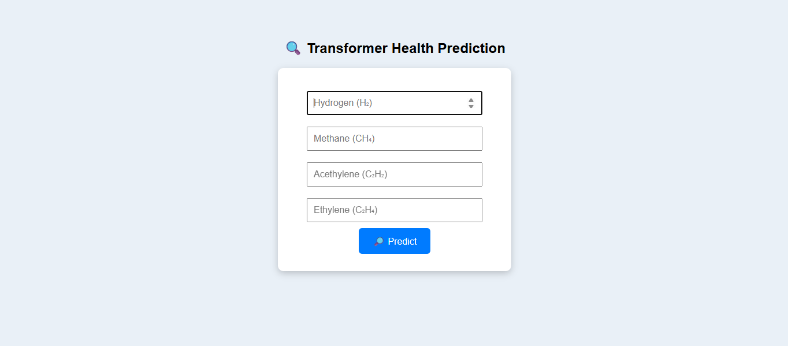
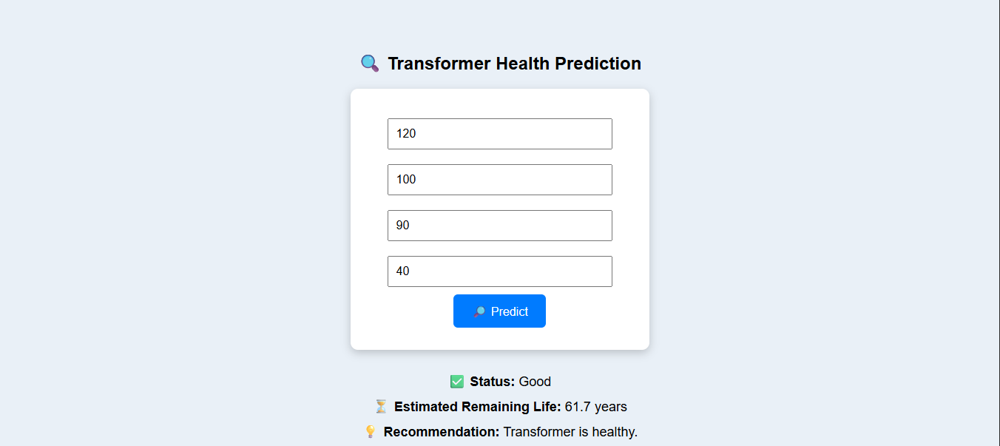

# ⚡ Power Transformer Health & Life Prediction

This project predicts the **status** (Healthy or Faulty) and the **estimated remaining life** of a power transformer using gas concentration inputs. The web interface is built using Flask and allows users to input gas values and receive instant predictions.

---

## 📊 Problem Statement

Power transformers are essential assets in electrical networks. Failures can lead to significant disruptions and costs. Dissolved gas analysis (DGA) helps in early detection of faults and estimation of remaining life.

---

## 🧠 Solution Overview

- **Input:** Concentrations of 4 key gases:
  - Hydrogen (H₂)
  - Methane (CH₄)
  - Acetylene (C₂H₂)
  - Ethylene (C₂H₄)

- **Output:**
  - **Status**: Healthy / Faulty
  - **Estimated Remaining Life** (in years)

Models used:
- `transformer_status_model.pkl` – Classification model for health status.
- `transformer_life_model.pkl` – Regression model for remaining life.

---

## 🖼️ Sample Interface

### Input Screen:


### Output Example:


---

## 🗂 Project Structure

| File | Description |
|------|-------------|
| `app.py` | Flask application logic |
| `index.html` | Frontend UI for user input and result display |
| `scaler.pkl` | Preprocessing scaler used during training |
| `transformer_status_model.pkl` | Classification model |
| `transformer_life_model.pkl` | Regression model |
| `synthetic_transformer_dataset.csv` | Dataset used for training |
| `test.ipynb` | Notebook for testing and evaluation |

---

## 🚀 How to Run

1. Install the requirements:
   ```bash
   pip install flask pandas scikit-learn
   ```

2. Run the Flask app:
   ```bash
   python app.py
   ```

3. Open in browser:
   ```
   http://localhost:5000
   ```

---

## 🧰 Tech Stack

- Python
- Flask
- Scikit-learn
- Pandas, NumPy
- HTML/CSS (Basic UI)

---

## 📬 Contact

[GitHub – NA7RAWY](https://github.com/NA7RAWY)
